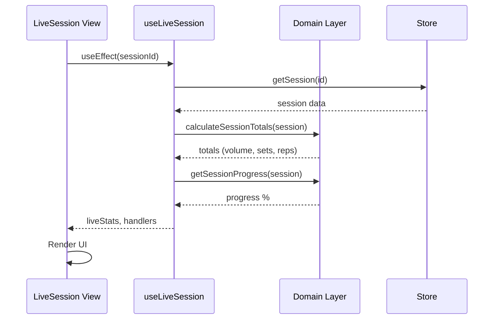
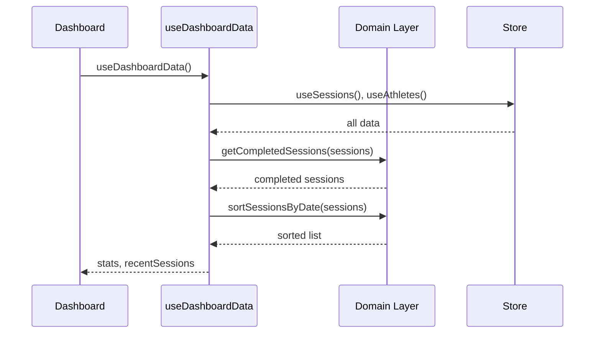
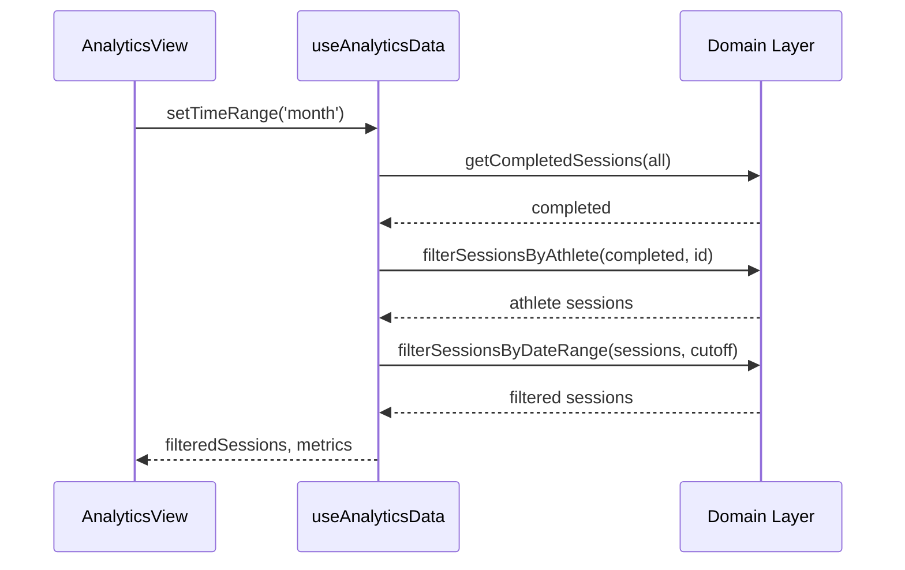

# Flujos de Datos Clave - SADR Training OS

## Arquitectura de Capas

```
┌─────────────────────────────────────────────────────────────┐
│                     VIEWS (React Components)                 │
│  AthleteDetail, SessionBuilder, LiveSession, AnalyticsView  │
└─────────────────────────┬───────────────────────────────────┘
                          │ uses
┌─────────────────────────▼───────────────────────────────────┐
│                     HOOKS (React Hooks)                      │
│  useLiveSession, useDashboardData, useAnalyticsData,        │
│  useCalendarView, useTrainingPlan                           │
└─────────────────────────┬───────────────────────────────────┘
                          │ imports
┌─────────────────────────▼───────────────────────────────────┐
│                    DOMAIN LAYER (Pure TS)                    │
│  sessions, athletes, exercises, templates, performance      │
└─────────────────────────┬───────────────────────────────────┘
                          │ uses
┌─────────────────────────▼───────────────────────────────────┐
│                    STORE (Zustand)                          │
│  trainingStore.ts, aiStore.ts                               │
└─────────────────────────────────────────────────────────────┘
```

---

## Flujo 1: Live Session



---

## Flujo 2: Dashboard Stats



---

## Flujo 3: Analytics Filtering



---

## Domain Functions Reference

| Function | Module | Purpose |
|----------|--------|---------|
| `calculateSessionTotals` | sessions | Volume, sets, reps totals |
| `getSessionProgress` | sessions | Completion % |
| `getCompletedSessions` | sessions | Filter by status |
| `sortSessionsByDate` | sessions | Sort newest first |
| `filterSessionsByAthlete` | sessions | Filter by athlete ID |
| `filterSessionsByDateRange` | sessions | Filter by date |
| `calculateVolumeLoad` | performance | weight × reps × sets |
| `classifyLoad` | performance | light/moderate/heavy/max |
