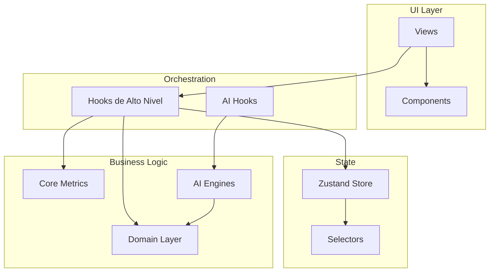

# 10 - Auditoría: Estructura General

> **Objetivo**: Radiografía objetiva de la arquitectura actual de SADR Training OS

---

## 1. Mapa de Carpetas

```
src/
├── views/              # 12 vistas principales (Dashboard, LiveSession, etc.)
├── components/         # 96 componentes (UI, session, analytics, common)
│   ├── ui/aura/        # Design system Aura
│   ├── session/        # SessionTimeline, SetRow, etc.
│   ├── analytics/      # Gráficos y métricas
│   └── common/         # Badges, modals, inputs
├── hooks/              # 17 hooks de alto nivel
├── domain/             # 6 módulos de dominio puro
│   ├── sessions/       # types, mappers, workout
│   ├── plans/          # types, adherence, calendar
│   ├── performance/    # types, metrics (intensidad/fatiga)
│   ├── athletes/       # types
│   ├── exercises/      # types
│   └── templates/      # types
├── store/              # Zustand - 11 archivos
│   ├── store.ts        # Store principal + selectores
│   ├── selectors.ts    # Selectores optimizados
│   └── *Slice.ts       # 8 slices de dominio
├── ai/                 # 30 archivos
│   ├── AIOrchestrator  # Coordinador principal
│   ├── engines/        # 6 motores (weeklyPlan, session, template, etc.)
│   ├── hooks/          # 7 hooks (useLoadPrediction, useSessionGenerator, etc.)
│   ├── performance/    # performanceEngine
│   └── providers/      # Mock, OpenAI, Anthropic
├── core/               # 11 archivos
│   ├── analysis/       # metrics.ts (926 líneas - motor principal)
│   ├── sessions/       # sessionStructure.model.ts
│   └── config/         # trainingConfig
├── utils/              # 15 helpers (dateHelpers, sessionLog, etc.)
└── types/              # types.ts central (609 líneas)

docs/
├── 01-04              # Documentación de fases anteriores
├── 05-06              # Estado actual hooks/dominio (Fase 4)
└── system_improvement_plan  # Plan de mejoras IA
```

---

## 2. Arquitectura General

| Aspecto | Tecnología/Enfoque |
|---------|-------------------|
| **Framework** | React 18 + TypeScript + Vite |
| **Routing** | React Router DOM |
| **Estado** | Zustand con persist (localStorage) |
| **Estilos** | Tailwind CSS + Design System Aura |
| **Animaciones** | Framer Motion |
| **IA** | AIOrchestrator + engines modulares |
| **Métricas** | core/analysis/metrics.ts (single source) |
| **Dominio** | Capas puras en src/domain/* |

---

## 3. Vistas Principales

| Vista | Archivo | Líneas | Rol |
|-------|---------|--------|-----|
| **Dashboard** | Dashboard.tsx | 21506 bytes | Hub central del coach |
| **Calendar** | CalendarView.tsx | 22580 bytes | Vista mensual de sesiones |
| **LiveSession** | LiveSession.tsx | 19571 bytes | Ejecución en tiempo real |
| **Templates** | TemplatesView.tsx | 17518 bytes | Gestión de plantillas |
| **Athletes** | AthletesList.tsx | 13263 bytes | Lista de atletas |
| **AthleteDetail** | AthleteDetail.tsx | 14298 bytes | Ficha de atleta |
| **Exercises** | ExercisesView.tsx | 14935 bytes | Catálogo de ejercicios |
| **Analytics** | AnalyticsView.tsx | 14932 bytes | Métricas y gráficos |
| **Sessions** | SessionBuilder.tsx | 11699 bytes | Crear/gestionar sesiones |
| **Settings** | SettingsView.tsx | 24911 bytes | Configuración |

---

## 4. Slices de Zustand

| Slice | Archivo | Datos | Rol en Flujo Coach |
|-------|---------|-------|---------------------|
| **athletes** | athletesSlice.ts | `Athlete[]` | Lista de atletas del coach |
| **sessions** | sessionsSlice.ts | `WorkoutSession[]` | Sesiones (planned/in_progress/completed) |
| **templates** | templatesSlice.ts | `SessionTemplate[]` | Plantillas reutilizables |
| **plans** | plansSlice.ts | `TrainingPlan[], activeTrainingPlanId` | Planes de entrenamiento |
| **exercises** | exercisesSlice.ts | `Exercise[]` | Catálogo de ejercicios |
| **settings** | settingsSlice.ts | `Settings` | Preferencias de usuario |
| **config** | configSlice.ts | `TrainingConfig` | Patrones, grupos musculares, 1RM |
| **lab** | labSlice.ts | `LabEntry[]` | Experimentos internos |

**Selectores en store.ts** (20+):
- Básicos: `useAthletes`, `useSessions`, `useExercises`, `useTemplates`
- Filtrados: `useCompletedSessions`, `usePlannedSessions`, `useInProgressSessions`
- Por atleta: `useSessionsByAthlete`, `useActiveAthletes`
- Aggregados: `useWeeklySessionCount`, `useTemplateUsageStats`

---

## 5. Hooks de Alto Nivel (src/hooks/)

| Hook | Líneas | Qué hace | Slices que toca |
|------|--------|----------|-----------------|
| **useLiveSession** | 17813 bytes | Gestión completa de sesión en vivo | sessions, exercises, athletes, settings |
| **useCalendarView** | 13403 bytes | Navegación de calendario, sesiones por fecha | sessions, athletes, plans, templates |
| **useTrainingPlanCalendar** | 10211 bytes | Sincroniza plan con calendario | plans, sessions, templates |
| **useAnalyticsData** | 10101 bytes | Métricas filtradas para Analytics | sessions, athletes, exercises |
| **useDashboardData** | 9948 bytes | Estadísticas para Dashboard | sessions, templates, athletes |
| **useSessionBuilder** | 8271 bytes | Crear sesiones desde templates | sessions, templates, athletes |
| **useSetRow** | 8103 bytes | Estado local de un set en LiveSession | (props, no store) |
| **useOneRMAnchorManager** | 7936 bytes | Gestión de 1RM anchors | config |
| **useExercisePicker** | 6507 bytes | Filtrado de ejercicios | exercises, config |
| **useWeeklySchedule** | 6313 bytes | Vista semanal para Dashboard | sessions, plans, athletes |
| **useTrainingPlan** | 5796 bytes | Facade: plan activo + adherencia + calendario | plans, sessions |
| **useSessionMetrics** | 4148 bytes | Métricas de sesión única | (via core/analysis) |
| **useActiveTrainingPlan** | 3670 bytes | CRUD de plan activo | plans |
| **useTrainingAdherence** | 3549 bytes | Cálculo de adherencia semanal | plans, sessions |
| **useRestTimer** | 3157 bytes | Cronómetro de descanso | (local state) |
| **useAthleteStats** | 2087 bytes | Stats de atleta | sessions |

---

## 6. Capa de Dominio (src/domain/)

### sessions/
| Archivo | Funciones/Tipos |
|---------|-----------------|
| types.ts | `SessionStatus`, `SetEntry`, `ExerciseEntry`, `WorkoutSession` |
| mappers.ts | `createScheduledSessionFromTemplate`, `startScheduledSession`, `completeSession` |
| workout.ts | `completeSet`, `addSet`, `removeSet`, `addExerciseToSession`, `startSession`, `finishSession` |

### plans/
| Archivo | Funciones/Tipos |
|---------|-----------------|
| types.ts | `TrainingPlan`, `WeekPlan`, `PlannedSession`, `DayPlan` |
| adherence.ts | `calculateWeeklyAdherence`, `getAdherenceLevel`, `generateAdherenceRecommendations` |
| calendar.ts | `buildWeekDays`, `buildCalendarMonth`, `isTrainingDay`, `getSessionsForDate` |

### performance/
| Archivo | Funciones/Tipos |
|---------|-----------------|
| types.ts | `PerformanceMetrics`, `WeeklyMetrics`, `FatigueLevel` |
| metrics.ts | `getSetIntensity`, `getExerciseIntensityFatigue`, `getSessionIntensityFatigue`, `getWeeklyLoadSeries` |

### athletes/, exercises/, templates/
- Solo tipos (sin lógica de negocio todavía)

---

## 7. Capa de Métricas (core/analysis/)

### metrics.ts (926 líneas - Single Source of Truth)

**Funciones de Set:**
- `computeTopSetLoadKg`, `computeTopSet`
- `computeEstimated1RM`, `computeSetE1RM`, `computeBestE1RM`

**Funciones de Volumen:**
- `computeSessionVolumeKg`, `computeVolumeByExercise`, `computeVolumeByBlock`
- `formatVolume`

**Funciones de RPE:**
- `computeAverageRPE`, `computeMaxRPE`

**Funciones de Sesión:**
- `computeSessionStats`

**Funciones Agregadas:**
- `calculateAthleteStats`, `calculateSessionMetrics`
- `getWeeklyIntensityFatigue`, `getAthleteIntensityFatigueSeries`

**Filtros:**
- `filterSessionsByAthlete`, `filterCompletedSessions`, `filterSessionsByDateRange`

---

## 8. Capa de IA (src/ai/)

### AIOrchestrator.ts
Coordinador central que:
- Registra engines
- Procesa prompts
- Gestiona contexto

### Engines (engines/)
| Engine | Rol |
|--------|-----|
| weeklyPlanEngine | Genera planes semanales |
| sessionEngine | Genera/sugiere sesiones |
| templateEngine | Crea templates |
| oneRMEngine | Análisis de 1RM |
| analyticsEngine | Insights de rendimiento |

### Performance (performance/)
| Archivo | Rol |
|---------|-----|
| performanceEngine.ts | Auto-deducción de 1RM, predicción de carga |

### Hooks de IA (hooks/)
| Hook | Rol |
|------|-----|
| useLoadPrediction | Predice peso para próximo set |
| useSessionGenerator | Genera sesión con IA |
| useTemplateGenerator | Genera template con IA |
| useWeeklyPlanGenerator | Genera plan semanal |
| useExerciseSuggestions | Sugiere ejercicios |

### Providers
- MockProvider (desarrollo)
- OpenAIProvider
- AnthropicProvider

---

## 9. Dominios Funcionales Identificados

| Dominio | Ubicación Principal | Estado |
|---------|---------------------|--------|
| **Atletas** | athletesSlice, AthleteDetail, AthletesList | Básico |
| **Ejercicios** | exercisesSlice, ExercisesView | Completo |
| **Templates** | templatesSlice, TemplatesView | Completo |
| **Sesiones** | domain/sessions, sessionsSlice, SessionBuilder | Bien estructurado |
| **Planes** | domain/plans, plansSlice, useTrainingPlan | Funcional |
| **Calendario** | domain/plans/calendar, CalendarView | Funcional |
| **LiveSession** | useLiveSession, LiveSession.tsx | Completo |
| **Analytics** | useAnalyticsData, AnalyticsView | Funcional |
| **Settings** | settingsSlice, SettingsView | Completo |

---

## 10. Resumen de Arquitectura



**Puntos fuertes observados:**
- Separación clara entre vistas, hooks y dominio
- Métricas centralizadas en core/analysis
- Dominio con funciones puras (workout, adherence, calendar)
- IA modular con engines especializados

**Puntos a revisar (próximos documentos):**
- Coherencia entre modelos de sesión (Template vs Planned vs Executed)
- Flujos de usuario reales
- Duplicidad residual en hooks
- Alineación IA-Dominio
