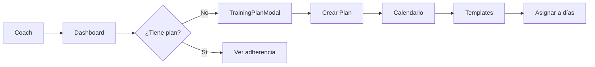
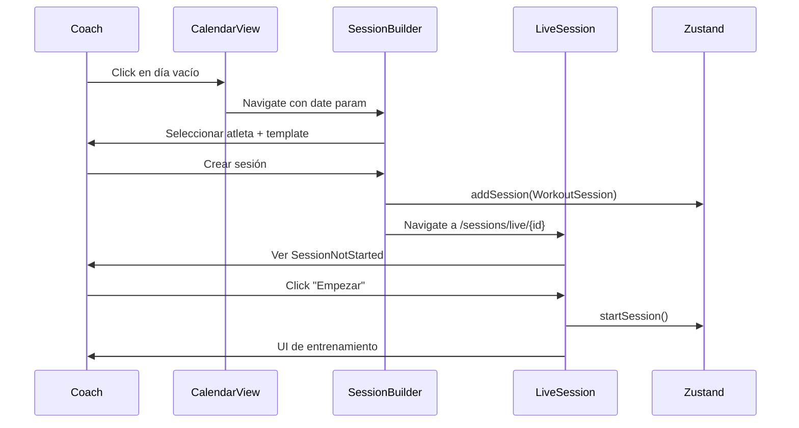

# 11 - Análisis de Flujos y Usabilidad (Modo Coach)

> **Objetivo**: Evaluar la experiencia real del coach en los flujos principales

---

## F1 – Planificación Semanal/Mensual

### Flujo Actual



### Vistas Implicadas
- **Dashboard** → WeeklyScheduleWidget, TodayTrainingWidget
- **Templates** → TemplatesView.tsx
- **Calendar** → CalendarView.tsx
- **Plans** → TrainingPlanModal (dentro de Dashboard)

### Hooks Implicados
- `useDashboardData` → stats, activePlan, weeklyAdherence
- `useTrainingPlan` → facade para plan + adherencia + calendario
- `useTrainingPlanCalendar` → sync plan ↔ calendario
- `useActiveTrainingPlan` → CRUD del plan

### Slices
- `plansSlice` (planes, activeTrainingPlanId)
- `templatesSlice` (plantillas disponibles)
- `sessionsSlice` (sesiones generadas)

### ✅ Fortalezas
- TrainingPlanModal permite crear planes desde Dashboard
- WeeklyScheduleWidget da visión clara de la semana
- Adherencia calculada automáticamente

### ⚠️ Debilidades / Incoherencias
1. **Confusión Template vs PlannedSession**: El coach crea plantillas (Template), luego el plan las referencia por ID, pero al generar la sesión real se crea una WorkoutSession. El flujo tiene 3 "niveles" de sesión:
   - `SessionTemplate` → estructura base reutilizable
   - `PlannedSession` (en WeekPlan) → referencia a template + día
   - `WorkoutSession` → sesión ejecutable real

2. **No hay vista dedicada de Plan**: El plan se gestiona desde modales y widgets, no hay una vista `/plans` completa.

3. **Calendario desconectado del plan**: CalendarView muestra sesiones pero no visualiza el plan subyacente claramente.

### ❓ Modelo mental vs App
- Coach piensa: "Quiero programar espalda el lunes"
- App requiere: Crear template → Crear plan → Asignar template al día → Generar sesión

---

## F2 – Dashboard como Punto de Entrada

### Lo que ve el Coach al entrar

```
┌─────────────────────────────────────────────────────────────┐
│ AI Insight Banner (si aplica)                               │
│ FatigueIndicator (si plan activo o actividad alta)          │
├─────────────────────────────────────────────────────────────┤
│ WeeklyScheduleWidget                                         │
│ ┌─────┐ ┌─────┐ ┌─────┐ ┌─────┐ ┌─────┐ ┌─────┐ ┌─────┐    │
│ │ Mon │ │ Tue │ │ Wed │ │ Thu │ │ Fri │ │ Sat │ │ Sun │    │
│ │ ··· │ │ ··· │ │ ··· │ │ ··· │ │ ··· │ │ ··· │ │ ··· │    │
│ └─────┘ └─────┘ └─────┘ └─────┘ └─────┘ └─────┘ └─────┘    │
├─────────────────────────────────────────────────────────────┤
│ TodayTrainingWidget (sesiones de hoy por atleta)            │
├─────────────────────────────────────────────────────────────┤
│ Metrics: Volume | Sessions | Duration | Avg Intensity       │
├─────────────────────────────────────────────────────────────┤
│ Active Session Panel / Recent Sessions                       │
├─────────────────────────────────────────────────────────────┤
│ Training Plan Overview / Adherence                           │
└─────────────────────────────────────────────────────────────┘
```

### ✅ Fortalezas
- **WeeklyScheduleWidget**: Vista clara Mon-Sun con sesiones
- **Métricas clickables**: Navegan a Analytics con foco
- **AIInsightBanner**: Recomendaciones contextuales
- **FatigueIndicator**: Alerta de sobreentrenamiento

### ⚠️ Debilidades
1. **Demasiada información**: El Dashboard es denso, podría abrumar
2. **TodayTrainingWidget redundante**: Ya está en WeeklySchedule
3. **Quick Actions dispersas**: "Nueva Sesión" vs "Repetir Última" vs "Ver Calendario"

### ❓ Preguntas que el coach quiere responder
| Pregunta | ¿Responde bien? |
|----------|-----------------|
| ¿Qué toca hoy? | ✅ WeeklySchedule + TodayWidget |
| ¿Qué hice esta semana? | ⚠️ Solo métricas, no detalle |
| ¿Estoy cumpliendo el plan? | ✅ Adherencia visible |
| ¿Algún atleta necesita atención? | ⚠️ No hay vista multi-atleta clara |

---

## F3 – Plan → Calendario → Sesión → LiveSession

### Flujo Paso a Paso



### Vistas y Hooks

| Paso | Vista | Hook | Acción Store |
|------|-------|------|--------------|
| 1. Elegir fecha | CalendarView | useCalendarView | — |
| 2. Crear sesión | SessionBuilder | useSessionBuilder | addSession() |
| 3. Pre-sesión | LiveSession | useLiveSession | — |
| 4. Iniciar | LiveSession | useLiveSession | updateSession(status: in_progress) |
| 5. Entrenar | LiveSession | useLiveSession | updateSession(exercises) |
| 6. Finalizar | LiveSession | useLiveSession | updateSession(status: completed) |

### ✅ Fortalezas
- **Estados claros**: planned → in_progress → completed
- **SessionNotStarted**: Estado de pre-visualización antes de empezar
- **SessionCompletedSummary**: Resumen post-sesión
- **domain/sessions/workout**: Mutaciones puras centralizadas

### ⚠️ Debilidades
1. **SessionBuilder desconectado de Template**: Al crear sin template, no se sugieren ejercicios
2. **No hay edición post-programación**: Una vez creada, la sesión se edita en LiveSession
3. **Falta preview de estructura**: El coach no ve cómo quedará la sesión antes de entrar

### ❓ Puntos de fricción
- Si el coach quiere cambiar la fecha de una sesión → ¿cómo?
- Si el coach quiere duplicar una sesión → existe pero no es obvio

---

## F4 – Ejecución en LiveSession

### Estados de la UI

```
   ┌──────────────┐     Click      ┌──────────────────┐     Finish     ┌──────────────────────┐
   │   planned    │ ──────────────▶│   in_progress    │ ──────────────▶│     completed        │
   │              │   "Empezar"    │                  │   "Finalizar"  │                      │
   │SessionNotStarted              │ Full Workout UI  │                │SessionCompletedSummary
   └──────────────┘                └──────────────────┘                └──────────────────────┘
```

### Componentes en in_progress
- **LiveSessionHeader**: Título, atleta, timer
- **ExerciseTabs**: Pestañas de ejercicios
- **SetRow**: Fila de cada set con inputs
- **SessionTimeline**: Vista lateral de progreso
- **RestTimer**: Cronómetro de descanso
- **LoadSuggestion**: Predicción IA de peso
- **OneRMHint**: Sugerencia de 1RM

### ✅ Fortalezas
- **SetRow completo**: RPE, RIR, notas, duplicar set anterior
- **LoadSuggestion con IA**: Predicción inteligente de peso
- **Auto-deducción 1RM**: Al finalizar, actualiza records
- **Timeline con bloques**: Visualiza estructura (warm-up, main, accessories)

### ⚠️ Debilidades
1. **Navegación entre ejercicios**: Solo tabs, en móvil podría ser incómodo
2. **No hay undo de set completado**: Hay "uncomplete" pero no es obvio
3. **Rest timer manual**: No se integra automáticamente con el flujo de sets
4. **FatiguePrompt al inicio**: Puede interrumpir el flujo

### ❓ Fricción en tiempo real
- Coach entrenando: pesa 80kg, anota, descansa, ¿dónde quedó?
- La información está pero puede perderse entre tabs

---

## F5 – Analytics

### Métricas Mostradas

| Métrica | Fuente | Tiempo Real |
|---------|--------|-------------|
| Volumen total | computeSessionVolumeKg | ✅ |
| Top Set Load | computeTopSetLoadKg | ✅ |
| Best e1RM | computeBestE1RM | ✅ |
| Avg RPE | computeAverageRPE | ✅ |
| Working Sets | count | ✅ |
| Weekly Volume Chart | weeklyVolume[] | ✅ |
| Top Exercises | topExercises[] | ✅ |
| Intensity/Fatigue | getWeeklyIntensityFatigue | ✅ |

### Series Temporales
- **Volumen semanal**: Últimas 8 semanas
- **Intensidad/Fatiga**: Promedio semanal

### ✅ Fortalezas
- **Filtros por atleta y tiempo**: Flexibles
- **Métricas del motor centralizado**: core/analysis/metrics
- **Coreografía con Dashboard**: Métricas clickables llevan a Analytics

### ⚠️ Lo que NO responde bien

| Pregunta del Coach | Respuesta actual |
|--------------------|------------------|
| ¿Cómo evolucionan mis bloques? | ❌ No hay vista por bloque en tiempo |
| ¿Estoy en overtraining? | ⚠️ FatigueIndicator existe pero es básico |
| ¿Qué atleta progresa más? | ❌ No hay comparativa multi-atleta |
| ¿Mi adherencia mejora o empeora? | ⚠️ Solo semana actual, no tendencia |
| ¿Qué ejercicio estanca a mi atleta? | ❌ No hay análisis de mesetas |

### ❓ Analytics vs realidad del coach
- El coach quiere **insights accionables**, no solo números
- Falta **narrativa**: "Esta semana bajaste volumen 10%, considera..."
- Falta **comparativa temporal**: "vs semana pasada", "vs mes pasado"

---

## Resumen de Flujos

| Flujo | Solidez | Notas |
|-------|---------|-------|
| F1 - Planificación | ⚠️ 70% | Funcional pero conceptos mezclados |
| F2 - Dashboard | ✅ 85% | Buen hub, quizás denso |
| F3 - Plan→Live | ✅ 85% | Flujo claro con estados |
| F4 - LiveSession | ✅ 90% | Muy completo |
| F5 - Analytics | ⚠️ 75% | Datos sí, insights no |

---

## Notas para Próximos Docs

Temas a profundizar en doc 12 (Coherencia):
- Separación Template / PlannedSession / WorkoutSession
- Duplicidad residual en hooks
- Alineación IA-dominio

Temas para doc 13 (Deuda):
- Vista de planes dedicada
- Comparativa multi-atleta
- Tendencias de adherencia
