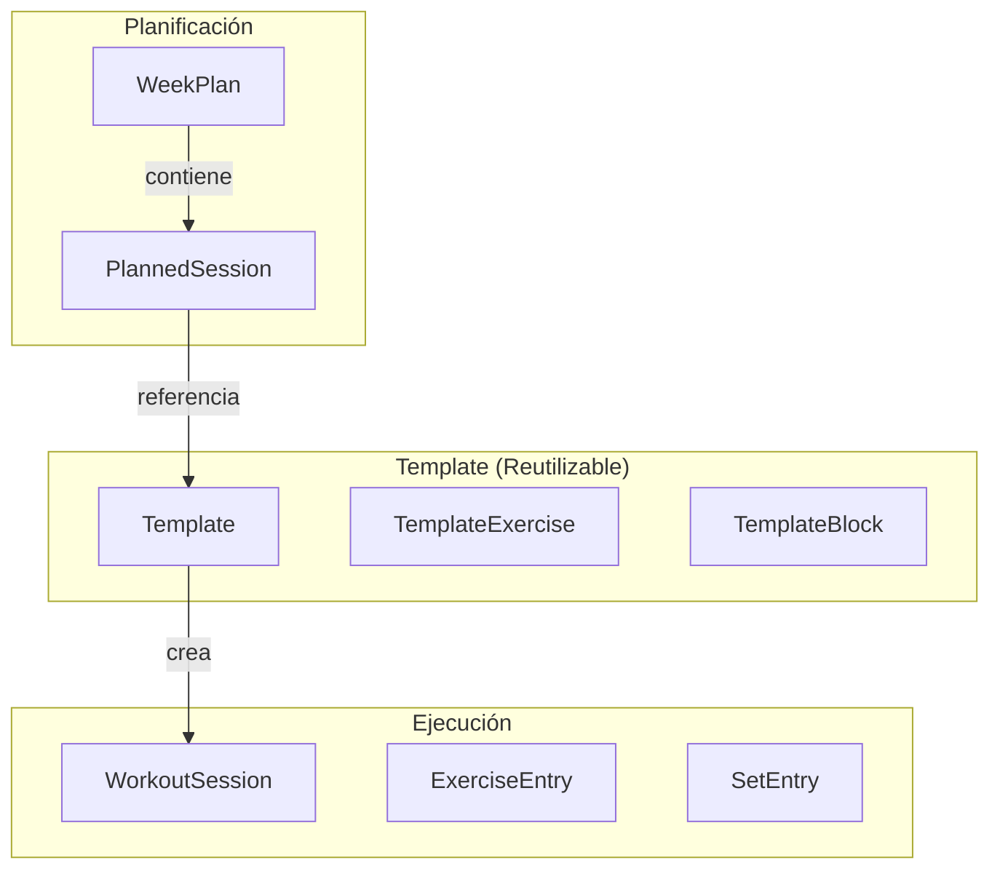

# 12 - Coherencia: Dominio, Hooks e IA

> **Objetivo**: Evaluar la alineación entre el modelo de dominio, los hooks y la capa de IA

---

## 1. Modelo de Sesiones

### Los 3 Niveles de "Sesión"



### Definición de Tipos

| Tipo | Ubicación | Propósito |
|------|-----------|-----------|
| **Template** | domain/templates/types | Estructura reutilizable (ejercicios, sets objetivo) |
| **TemplateExercise** | domain/templates/types | Ejercicio en template (sets: number, no SetEntry[]) |
| **PlannedSession** | domain/plans/types | Referencia ligera (templateId, dayOfWeek) |
| **WorkoutSession** | domain/sessions/types | Sesión ejecutable (exercises: ExerciseEntry[]) |
| **ExerciseEntry** | domain/sessions/types | Ejercicio con sets reales |
| **SetEntry** | domain/sessions/types | Set con target y actual |

### ✅ Bien Separado
- `Template` usa `sets: number` → solo cuenta
- `WorkoutSession` usa `sets: SetEntry[]` → detalle completo
- `PlannedSession` es ligera, solo referencia

### ⚠️ Puntos de Confusión Residual

1. **types/types.ts duplica definiciones**:
   - `WorkoutSession` existe en AMBOS `types/types.ts` y `domain/sessions/types.ts`
   - Mismo nombre, ¿misma definición? Riesgo de divergencia

2. **SessionTemplate vs Template**:
   - En `types/types.ts` hay `WorkoutTemplate`
   - En `domain/templates/types.ts` hay `Template`
   - Son equivalentes pero con nombres distintos

3. **mappers.ts transforma pero no valida**:
   - `createScheduledSessionFromTemplate()` asume template válido
   - No hay validación de estructura

### ❌ Zona Peligrosa
- **PlannedSession no contiene ejercicios**: Solo `templateId` y `dayOfWeek`
- Si el template cambia después de planificar, la sesión generada será diferente
- No hay "snapshot" del template al momento de planificar

---

## 2. Capa de Métricas / Performance

### Ubicación de Funciones

| Función | Ubicación | Tipo |
|---------|-----------|------|
| `computeSessionVolumeKg` | core/analysis/metrics | Set-level |
| `computeTopSetLoadKg` | core/analysis/metrics | Set-level |
| `computeBestE1RM` | core/analysis/metrics | Set-level |
| `computeAverageRPE` | core/analysis/metrics | Set-level |
| `calculateSessionTotals` | domain/sessions/types | Session-level |
| `getSessionIntensityFatigue` | domain/performance/metrics | Session-level |
| `getWeeklyLoadSeries` | domain/performance/metrics | Multi-session |
| `calculateWeeklyAdherence` | domain/plans/adherence | Plan-level |

### ✅ Centralización Actual
- **core/analysis/metrics** (926 líneas): Single source para cálculos de set
- **domain/performance/metrics** (464 líneas): Intensidad/fatiga
- **domain/plans/adherence**: Adherencia

### ⚠️ Aún Hay Dispersión

1. **domain/sessions/types.ts tiene cálculos**:
   - `calculateSetVolume`, `calculateSessionTotals`
   - Duplica lo que hace `computeSessionVolumeKg`

2. **Hooks todavía calculan inline**:
   ```typescript
   // useAnalyticsData.ts línea ~170
   const weeklyVolume = useMemo(() => {
       const weeks: Record<string, number> = {};
       filteredSessions.forEach(s => {
           // ... cálculo inline
       });
   });
   ```
   Debería usar `getWeeklyLoadSeries` de domain/performance

3. **useDashboardData repite filtros**:
   - Filtra sesiones por semana
   - Podría usar `filterSessionsByDateRange` de domain/sessions

---

## 3. Hooks de Alto Nivel

### Categorización Post-Fase 4

| Hook | Categoría | Estado |
|------|-----------|--------|
| **useLiveSession** | A (Orquestador) | ✅ Refactorizado - usa domain/sessions/workout |
| **useTrainingAdherence** | A (Orquestador) | ✅ Refactorizado - usa domain/plans/adherence |
| **useDashboardData** | A (Orquestador) | ⚠️ Lógica inline residual |
| **useAnalyticsData** | A (Orquestador) | ⚠️ Lógica inline residual |
| **useSessionBuilder** | A (Orquestador) | ⚠️ Podría usar mappers |
| **useCalendarView** | A (Orquestador) | ⚠️ No usa domain/plans/calendar |
| **useWeeklySchedule** | A (Orquestador) | ⚠️ No usa domain/plans/calendar |
| **useRestTimer** | C (Utilitario) | ✅ Perfecto |
| **useSetRow** | C (UI) | ✅ Bien enfocado |

### ⚠️ Hooks que Deberían Delegar Más

1. **useSessionBuilder**:
   - `handleCreateSession` construye ExerciseEntry[] inline
   - Debería usar `createScheduledSessionFromTemplate` de domain/sessions/mappers

2. **useCalendarView**:
   - Construye días del mes inline
   - Debería usar `buildCalendarMonth` de domain/plans/calendar

3. **useWeeklySchedule**:
   - Define `getWeekStart` localmente
   - Ya existe `getWeekStartMonday` en domain/plans/calendar

---

## 4. Capa de IA

### Engines y su Alineación con Dominio

| Engine | Usa Tipos de Dominio | Alineación |
|--------|----------------------|------------|
| **weeklyPlanEngine** | `DayPlan`, `WeekDay` | ⚠️ Parcial |
| **sessionEngine** | `WorkoutSession`, `Exercise` | ⚠️ Mezcla types/types |
| **templateEngine** | `Template`, `MuscleGroup` | ⚠️ Mezcla types/types |
| **oneRMEngine** | `Athlete`, `Session` | ✅ Bien alineado |
| **analyticsEngine** | `WorkoutSession` | ✅ Bien alineado |
| **performanceEngine** | `SetEntry`, `Athlete` | ✅ Bien alineado |

### ✅ Aspectos Sólidos

1. **AIOrchestrator con validación**:
   - Usa Zod schemas (`inputSchemas.ts`)
   - Valida antes de llamar a engines

2. **performanceEngine usa domain**:
   - `detectOvertraining` usa métricas de dominio
   - `generateLoadSuggestion` es puro

3. **Hooks de IA bien separados**:
   - `useLoadPrediction`, `useSessionGenerator`, etc.
   - Llaman a engines, no reimplementan

### ⚠️ Áreas de Mejora

1. **sessionEngine mezcla tipos**:
   ```typescript
   // sessionEngine.ts
   import type { WorkoutSession, Exercise } from '../../types/types';
   // Debería importar de domain/sessions
   ```

2. **weeklyPlanEngine genera DayPlan[]**:
   - `DayPlan` tiene `dayOfWeek: WeekDay` (string)
   - Pero algunos flujos esperan número (0-6)

3. **No hay mappers IA ↔ Dominio**:
   - Cuando IA genera una sesión, se pasa directo al store
   - Debería haber un `mapAISessionToWorkoutSession`

---

## 5. Preparación para Vista Atleta

### ¿Qué se Reutilizaría?

| Componente | Reutilizable | Notas |
|------------|--------------|-------|
| **domain/sessions** | ✅ 100% | Tipos y funciones agnósticas |
| **domain/performance** | ✅ 100% | Métricas por atleta ya existen |
| **core/analysis/metrics** | ✅ 100% | Cálculos puros |
| **useLiveSession** | ⚠️ 80% | Necesita param de modo (coach/atleta) |
| **useAnalyticsData** | ⚠️ 70% | Filtrar solo por atleta autenticado |
| **Dashboard** | ❌ 20% | Muy orientado a coach |
| **CalendarView** | ⚠️ 60% | Filtrar por atleta |

### ¿Qué Falta?

1. **Concepto de "usuario autenticado"**:
   - Actualmente no hay auth
   - Coach ve todos los atletas
   - Atleta vería solo su data

2. **Permisos en hooks**:
   - `useSessions()` retorna todas las sesiones
   - Atleta solo debería ver las suyas

3. **Vista simplificada**:
   - Atleta no necesita crear planes
   - Solo ver entrenamientos asignados y ejecutar

---

## 6. Resumen

### ✅ Aspectos Muy Sólidos

1. **Separación Template / WorkoutSession** - Bien definida
2. **domain/sessions/workout** - Mutaciones puras centralizadas
3. **domain/plans/adherence** - Cálculos puros refactorizados
4. **core/analysis/metrics** - Single source de cálculos
5. **AIOrchestrator con validación** - Entrada validada con Zod
6. **performanceEngine alineado** - Usa tipos de dominio

### ⚠️ Cosas a Medias

1. **Duplicación de tipos** - types/types.ts vs domain/*/types.ts
2. **PlannedSession muy ligera** - No hay snapshot del template
3. **Hooks no usan domain/plans/calendar** - Reimplementan localmente
4. **useAnalyticsData cálculos inline** - Debería usar domain/performance
5. **Engines importan de types/types** - Deberían usar domain/*

### ❌ Zonas Peligrosas

1. **types/types.ts monolítico** - 609 líneas, mezcla todo
2. **No hay validación en mappers** - Asumen inputs correctos
3. **Template mutable post-planificación** - Riesgo de inconsistencia
4. **No hay concepto de usuario/permisos** - Bloquea vista atleta
